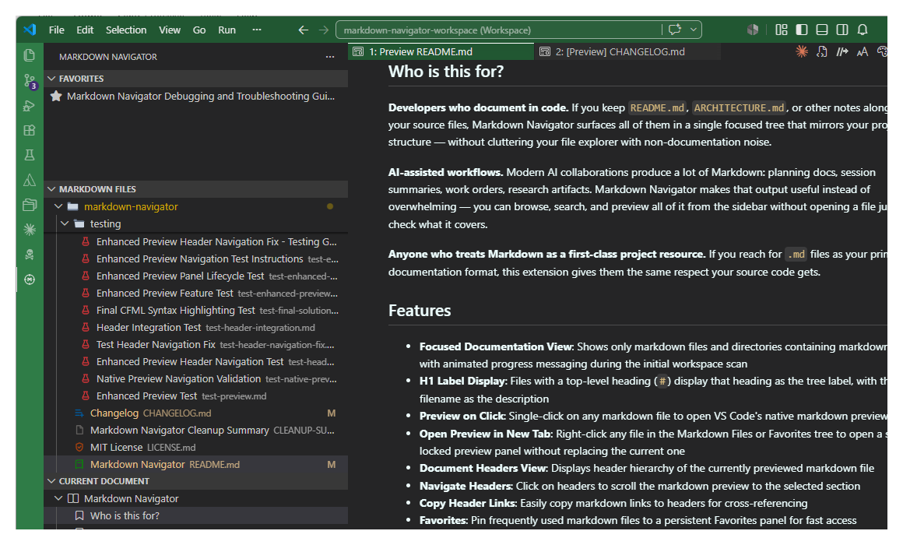

# Markdown Compass

Turn your codebase into a focused documentation hub by surfacing only its Markdown documents in a dedicated, navigable sidebar.

When your workspace is full of Markdown files — whether that's code-adjacent `README.md` and `SPEC.md` files scattered across your project, or a growing library of documentation artifacts from AI-assisted workflows — finding and reading the right file gets tedious fast. Markdown Compass solves that by turning every `.md` file in your workspace into a structured, navigable sidebar so you spend less time hunting and more time reading.

## Who is this for?

#### **Developers who document in code**
If you keep `README.md`, `ARCHITECTURE.md`, or other notes alongside your source files, Markdown Compass surfaces all of them in a single focused tree that mirrors your project structure — without cluttering your file explorer with non-documentation noise.

#### **Documentation artifacts from AI-assisted workflows**
Modern AI collaborations produce a lot of Markdown: planning docs, session summaries, work orders, research artifacts. Markdown Compass makes that output useful instead of overwhelming — you can browse, search, and preview all of it from the sidebar without opening a file just to check what it covers.

#### **Anyone who treats Markdown as a first-class project resource**
If you reach for `.md` files as your primary documentation format, this extension gives them the same respect your source code gets.

## Features

- **Focused Documentation View**: Shows only markdown files and directories containing markdown files, with animated progress messaging during the initial workspace scan
- **H1 Label Display**: Files with a top-level heading (`#`) display that heading as the tree label, with the filename as the description
- **Preview on Click**: Single-click on any markdown file to open VS Code's native markdown preview
- **Open Preview in New Tab**: Right-click any file in the Markdown Files or Favorites tree to open a second locked preview panel without replacing the current one
- **Document Headers View**: Displays header hierarchy of the currently previewed markdown file
- **Navigate Headers**: Click on headers to scroll the markdown preview to the selected section
- **Copy Header Links**: Easily copy markdown links to headers for cross-referencing
- **Favorites**: Pin frequently used markdown files to a persistent Favorites panel for fast access
- **Context Menu Options**: Right-click to open files in source/edit mode or preview mode
- **Hierarchical Display**: Matches the directory structure of your workspace (displays only those folders containing Markdown files)
- **Collapsible Sections**: Ability to collapse directories for better organization
- **Toggle .gitignore Filtering**: Enable or disable .gitignore filtering with one click
- **Search and Filter**: Fuzzy-match markdown folder names, file names, and markdown headers using the built-in tree filter (both `Search Markdown Files` and `Filter in Sidebar` toolbar commands expose this same filter)
- **File Statistics**: View comprehensive statistics including file count, total reading time, and file-size summary about your markdown documentation

## Usage

1. Click on the Markdown Compass icon in the activity bar (sidebar)
2. Browse through the "Markdown Files" tree to find markdown files
3. Click once on a markdown file to open it in VS Code's native markdown preview
4. The "Current Document" panel will automatically display the header structure of the previewed file
5. Click on any header in the headers view to target that section in the markdown preview
6. Right-click on any header to copy a markdown link to it for cross-referencing
7. Right-click any file in the Markdown Files or Favorites tree and choose **Open Preview in New Tab** to open an additional locked preview alongside the current one
8. Use the **Search** or **Filter in Sidebar** toolbar buttons to filter the tree by folder name, markdown file name, or markdown header text — both buttons expose the same fuzzy filter
9. Use the refresh button to update the view if files are added or changed
10. Click on the filter icon to toggle .gitignore filtering on/off
11. Use the statistics button to view comprehensive information about your markdown files
12. Right-click any file and choose **Add to Favorites** to pin it in the Favorites panel; use **Remove from Favorites** to unpin it

## Search Scope

The Markdown Files search is a live tree filter, not a separate full-text index. It currently matches:

- directory names shown in the Markdown Files tree
- markdown file names ending in `.md`
- markdown headers extracted from those files (`#` through `######`)

It does not currently search paragraph/body text, link URLs, or non-Markdown files.

When `.gitignore` filtering is enabled, ignored paths are excluded from both the tree and search results.

## Header Navigation

When you click on a header in the "Current Document" view, the extension targets VS Code's native markdown preview and attempts to move the preview to that heading using fragment-based navigation:

1. **Fragment Navigation**: Uses VS Code's built-in anchor system (most reliable)
2. **Alternative Anchors**: Tries different anchor formats if the first fragment does not land correctly
3. **Fallback**: Reopens the preview with search guidance if fragment targeting cannot resolve the heading

If automatic scrolling fails, the extension will provide the heading text and search guidance instead of silently leaving the preview at the wrong location.

## Requirements

No special requirements or dependencies. Markdown Compass uses VS Code's built-in Markdown preview — no external tools or preview engines to configure.

## Extension Settings

Markdown Compass contributes one native-preview safety setting:

- `markdownNavigator.safeLinkSuppression.enabled` (default: `true`) renders definitively broken local Markdown file links and broken cross-file Markdown heading fragments as inert styled text in VS Code's native Markdown preview.

Anchor-only links, valid local links, external URLs, and local non-Markdown fragments that cannot be validated are left unchanged.

## Almost-native Preview Styling

Markdown Compass relies on VS Code's built-in markdown preview for rendering and styling.

- The extension adds a small native preview stylesheet so suppressed broken local links render as neutral inert text instead of clickable anchors.
- The safe-link behavior applies to all native Markdown previews while Markdown Compass is active.
